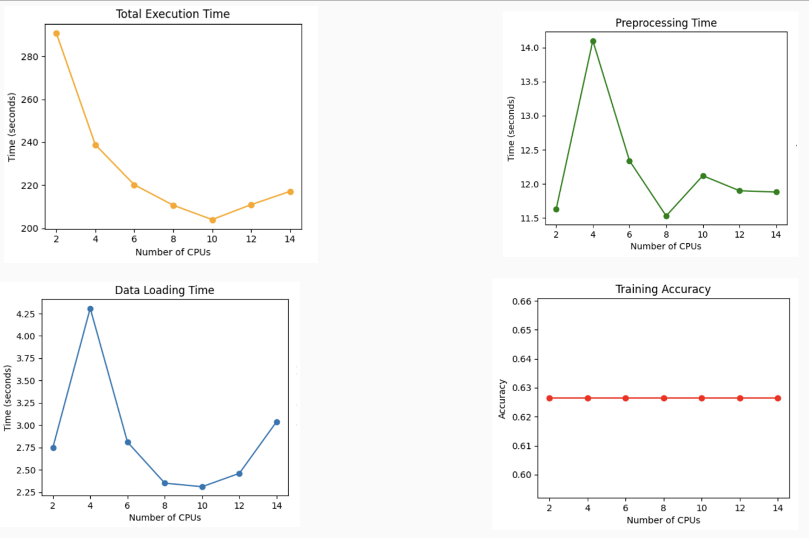
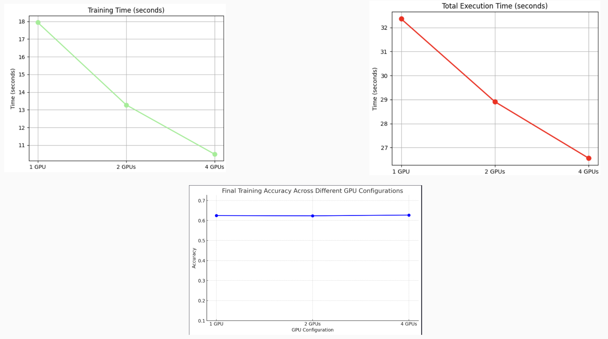

# Parallel XGBoost on CIFAR10 - Benchmarking and Optimization

## Description of the Project

This project focuses on benchmarking the XGBoost algorithm over the CIFAR10 dataset across various parallelization techniques. The key objective is to evaluate performance of the XGBoost algorithm in different hardware configurations, utilizing parallel computing framework Ray.

## Project Milestones and Their Completion Status

- **Feasibility Testing**
  - [x] Colossal AI + XGBoost compatibility
  - [x] Ray + XGBoost integration
- **Benchmarking**
  - [x] Ray + XGBoost on CPU (2 to 12 cores)
  - [x] Ray + XGBoost on single-node GPU (1, 2, 4 GPUs)
  - [x] Ray + XGBoost on multi-node GPU (1, 2, 4 GPUs)
  - [-] Benchmark distributed data loading with Hadoop
- **Analysis and Optimization**
  - [x] Analyze benchmark results
  - [x] Optimize for better performance with Ray Hyperparameter Tune

## Repository and Code Structure

This repository is organized into several directories and scripts, each with a specific purpose in the overall benchmarking and optimization process:

- **/cpu_only**: Contains scripts for running benchmarks on CPU-only configurations.

  - `cpu_only.py`: Execute this script to run the benchmarking on different CPU core configurations.

- **/distributed_data_loading**: Scripts related to the distributed loading of the CIFAR10 dataset.

  - `split_data.py`: Splits the dataset into multiple parquet files for distributed data loading
  - `train-code.py`: The main training script that uses distributed data.

- **/finetune**: Houses the scripts for model fine-tuning and hyperparameter optimization.

  - `main.py`: The primary script for running the fine-tuning processes.

- **multi_node**: Contains subdirectories for running benchmarks on multi-GPU, multi-node setups.

  - `1-gpu`, `2-gpus`, `4-gpus`: Each directory contains scripts configured for the respective number of GPUs across multiple nodes.

- **single_node**: Contains subdirectories for running benchmarks on single-node GPU setups.
  - `1-gpu`, `2-gpus`, `4-gpus`: Each directory includes scripts for running the benchmarks on 1, 2, or 4 GPUs on a single node.

## Example commands to execute the code

Each folder for system configuration contains run.BATCH file, you can directly run this batch file to execute the specific configuration. Make sure you have the necessary packages and python environment setup.

```batch
$ sbatch run.BATCH
```

## Results

Increasing the number of CPUs typically leads to a decrease in total execution time, indicating that the process benefits from parallel processing. However, the observed fluctuations in preprocessing and data loading times across varying CPU counts suggest that there may be non-linear overheads or resource contention issues that could be further examined and optimized. Such investigation could potentially lead to achieving more consistent performance improvements as CPU count increases.

In the context of GPU configurations within a single node, the pattern is analogous. As the number of GPUs is augmented, both training and total execution times tend to diminish significantly, which is in line with expectations of parallel computation advantages. Nonetheless, these reductions in time may not be perfectly proportional to the increase in GPU resources. This suboptimal scaling could be attributed to various forms of overhead, such as the cost of communication between GPUs, inefficient distribution of computation tasks, or other bottlenecks inherent to the system's architecture. Addressing these could enhance the scalability and efficiency of the system, potentially yielding closer to ideal time reductions in line with the increased number of GPUs.


